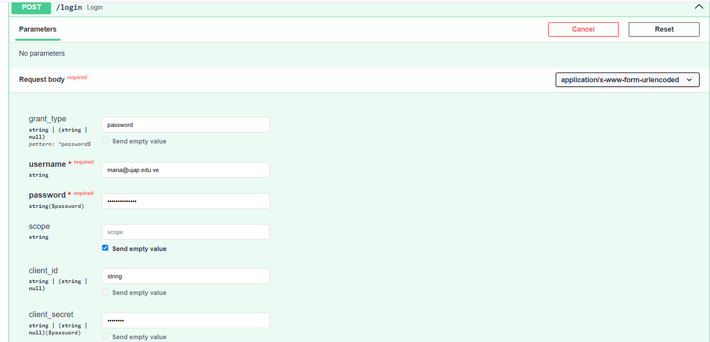
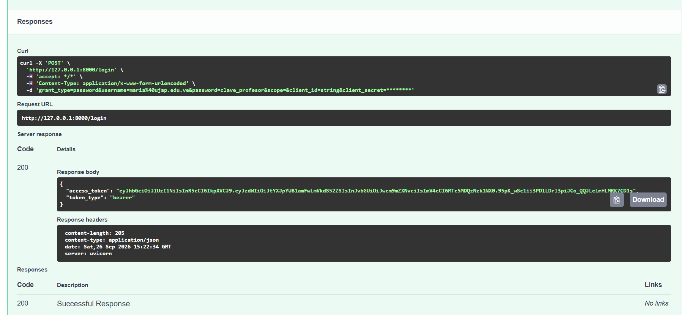
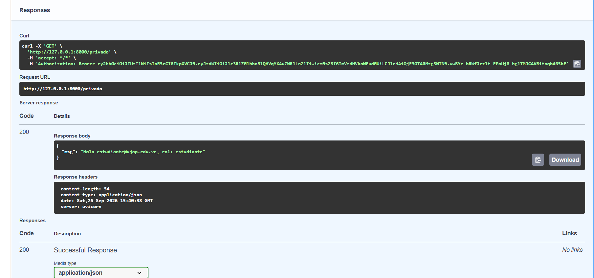
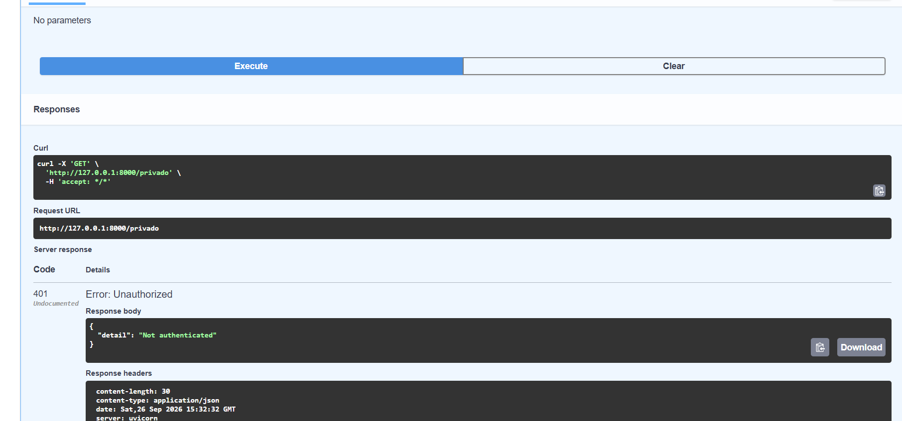
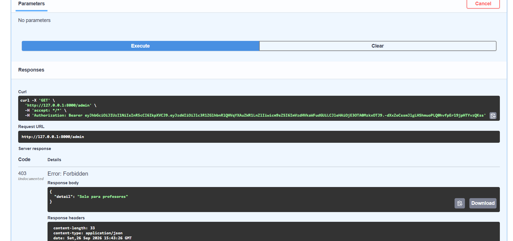

# API con JWT — UJAP

## Parte 1 — Preguntas

### P1. ¿Qué significa JWT y cuáles son sus tres partes?

JWT significa **JSON Web Token**. Es un estándar abierto diseñado para transmitir
información de forma segura entre un cliente y un servidor como un objeto JSON
compacto y autocontenido.

Sus tres partes fundamentales, separadas por puntos (`.`), son:

1. **Header (Encabezado):** especifica el tipo de token (JWT) y el algoritmo de
   firma utilizado (ej. HS256).
2. **Payload (Carga útil):** contiene los *claims* o afirmaciones del token, que
   incluyen datos del usuario (como `sub` para la identidad y `role` para sus
   permisos) y la fecha de expiración (`exp`).
3. **Signature (Firma):** se calcula cifrando la combinación del Header
   codificado, el Payload codificado y una clave secreta (`SECRET_KEY`) con el
   algoritmo especificado. Garantiza que el contenido del token no haya sido
   alterado.

### P2. ¿Por qué el payload NO es seguro para guardar contraseñas?

El Payload está simplemente codificado en **Base64Url, no cifrado ni
encriptado**. Cualquier persona o atacante que intercepte el token puede
decodificarlo fácilmente en segundos usando herramientas web sencillas y leer
todo su contenido en texto plano. Por este motivo, nunca deben incluirse
contraseñas, claves secretas, ni datos personales sensibles dentro del payload.

### P3. ¿Qué sucede si alguien modifica el payload sin conocer el SECRET_KEY?

Si un usuario altera cualquier dato del payload (por ejemplo, cambiando su rol de
`"estudiante"` a `"profesor"`), la firma del token deja de ser válida.

Cuando el servidor recibe la petición, recalcula la firma utilizando el header, el
payload modificado y la `SECRET_KEY` almacenada en el servidor. Al no coincidir el
resultado obtenido con la firma adjunta en el token enviado por el cliente, el
servidor detecta la manipulación, lanza un error de verificación (`JWTError`) y
rechaza la petición enviando una respuesta **401 Unauthorized**.

### P4. Diferencia entre 401 Unauthorized y 403 Forbidden. ¿Cuándo usa cada uno FastAPI?

- **401 Unauthorized (No Autenticado):** aplica cuando el cliente no se ha
  identificado adecuadamente.
  - *Uso en FastAPI:* ocurre en la capa de autenticación (`get_current_user`)
    cuando no se proporciona un token, cuando el token ha expirado o cuando la
    firma es inválida.
- **403 Forbidden (No Autorizado):** aplica cuando el cliente ya está autenticado
  correctamente, pero sus permisos o rol no son suficientes para acceder a la ruta
  solicitada.
  - *Uso en FastAPI:* ocurre en la lógica del endpoint (por ejemplo `/admin`)
    cuando el token decodificado muestra que el usuario tiene rol `"estudiante"`,
    pero el recurso exige rol `"profesor"`.

---

## Parte 2 — Capturas

### Captura 1 — `POST /login`: campos del *Request body*

### Captura 2 — `POST /login` → 200 con el `access_token`

### Captura 3 — `GET /privado` → 200 (token de estudiante)

### Captura 4 — `GET /privado` → 401 (no autenticado)

### Captura 5 — `GET /admin` → 403 (rol estudiante)

